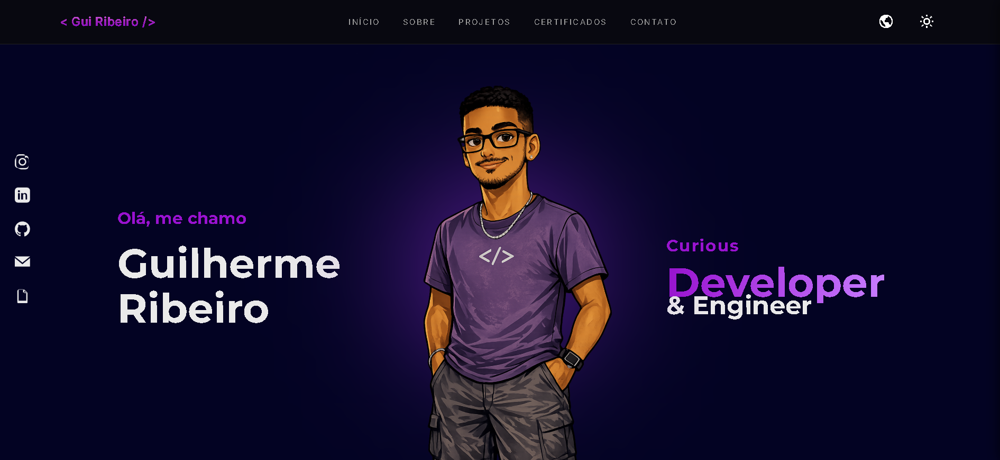

# 🚀 Guilherme Ribeiro — Portfólio Profissional

<p align="center">
  
</p>

<p align="center">
  <a href="https://gui-ribeiro.vercel.app/">
    
  </a>
  
  
</p>

---

## 📖 Sobre o Projeto

Este repositório contém o código-fonte do meu portfólio profissional. Mais do que um simples currículo online, este projeto foi concebido como um **ecossistema de demonstração técnica**. Aqui, aplico conceitos avançados de Front-End, arquitetura modular e soluções criativas para desafios comuns de desenvolvimento.

O objetivo principal é oferecer uma experiência de usuário (UX) fluida, performática e visualmente impactante, servindo como porta de entrada para minha jornada como desenvolvedor FullStack.

---

## 🎯 Tabela de Conteúdos

- [✨ Funcionalidades e Diferenciais](#-funcionalidades-e-diferenciais)
- [🛠️ Stack Tecnológica](#️-stack-tecnológica)
- [🧠 Destaques Técnicos](#-destaques-técnicos)
- [📂 Organização do Código](#-organização-do-codigo)
- [🚀 Como Executar](#-como-executar)
- [🔄 Próximas Atualizações](#-próximas-atualizações)
- [👨‍💻 Contato](#-contato)

---

## ✨ Funcionalidades e Diferenciais

| Recurso | Explicação Técnica |
| :--- | :--- |
| **🌍 Internacionalização (i18n)** | Sistema customizado em JS que gerencia traduções via objetos JSON, permitindo a troca de idioma sem recarregar a página. |
| **📄 PDF.js Integration** | Implementação de um visualizador de PDF robusto que renderiza documentos diretamente no `<canvas>`, garantindo segurança e compatibilidade. |
| **🎨 Design System Modular** | Arquitetura CSS baseada em variáveis e componentes, facilitando a manutenção e garantindo consistência visual. |
| **📱 Mobile First** | Layout totalmente responsivo, testado em múltiplos dispositivos para garantir a melhor usabilidade em qualquer tela. |
| **⚡ SEO & Acessibilidade** | Uso rigoroso de HTML5 semântico e práticas recomendadas para otimização em motores de busca e leitores de tela. |

---

## 🛠️ Stack Tecnológica

<div align="center">

| Tecnologia | Finalidade |
| :---: | :--- |
|  | **HTML5** — Estrutura semântica e acessível. |
|  | **CSS3** — Estilização moderna com Flexbox, Grid e Variáveis. |
|  | **JavaScript (ES6+)** — Lógica de negócio, i18n e interatividade. |
|  | **GitHub** — Versionamento e colaboração. |
|  | **Vercel** — Hospedagem e deploy contínuo (CI/CD). |

</div>

---

## 🧠 Destaques Técnicos

### 1. Sistema de Tradução Dinâmica
Diferente de soluções que dependem de múltiplas páginas HTML para cada idioma, este projeto utiliza uma camada de `translations.js` e um `i18n.js` core. Isso reduz o tempo de carregamento e melhora a experiência do usuário ao alternar entre Português e Inglês instantaneamente.

### 2. Segurança e CSP (Content Security Policy)
O arquivo `vercel.json` foi configurado estrategicamente para lidar com políticas de segurança rigorosas, permitindo a execução segura da biblioteca PDF.js e prevenindo ataques de XSS, mantendo o site protegido em ambiente de produção.

### 3. CSS Modularizado
O projeto não utiliza frameworks como Tailwind ou Bootstrap, optando por **Vanilla CSS**. A estrutura é dividida em:
- `base/`: Estilos globais e variáveis.
- `components/`: Elementos reutilizáveis (botões, cards).
- `features/`: Estilos específicos para funcionalidades complexas (como o viewer de PDF).

---

## 📂 Organização do Código

```text
📂 Portfolio Guilherme
 ┣ 📂 assets           # PDFs, imagens e ícones do sistema
 ┣ 📂 pages            # Conteúdo HTML dividido por seções
 ┣ 📂 scripts
 ┃ ┣ 📂 core           # Lógica central (i18n, router)
 ┃ ┣ 📂 features       # Scripts específicos (UI, Resume, Components)
 ┃ ┗ 📂 libs           # Bibliotecas externas (PDF.js local)
 ┣ 📂 styles
 ┃ ┣ 📂 base           # Resets e variáveis globais
 ┃ ┣ 📂 components     # Estilos de componentes isolados
 ┃ ┗ 📂 features       # Estilos para funcionalidades específicas
 ┣ 📜 index.html       # Entry point da aplicação
 ┗ 📜 vercel.json      # Regras de roteamento e segurança
```

---

## 🚀 Como Executar

Se desejar explorar o código localmente:

1. **Clone o repositório:**
   ```bash
   git clone https://github.com/gui-ribcosta/portfolio-guilherme-ribeiro.git
   ```
2. **Abra o projeto:**
   Basta abrir o arquivo `index.html` em qualquer navegador moderno.
3. **Dica para Desenvolvimento:**
   Recomendo o uso da extensão **Live Server** (VS Code) para visualização em tempo real das alterações.

---

## 🔄 Próximas Atualizações

- [ ] **Dark/Light Mode**: Implementação de switcher de tema nativo.
- [ ] **Novas Seções**: Galeria de certificados e seção de blog técnico.
- [ ] **Micro-interações**: Adição de animações sutis via Framer Motion ou CSS Animations para melhorar o feedback visual.

---

## 👨‍💻 Contato

Sinta-se à vontade para explorar meus projetos e entrar em contato:

<p align="left">
  <a href="https://www.linkedin.com/in/guiribcosta/" target="_blank">
    
  </a>
  <a href="https://instagram.com/gui_ribcosta" target="_blank">
    
  </a>
  <a href="mailto:grcm171914@gmail.com" target="_blank">
    
  </a>
</p>

---

<p align="center">
  <i>"Transformando café em código e ideias em experiências digitais."</i> ☕🚀
</p>
